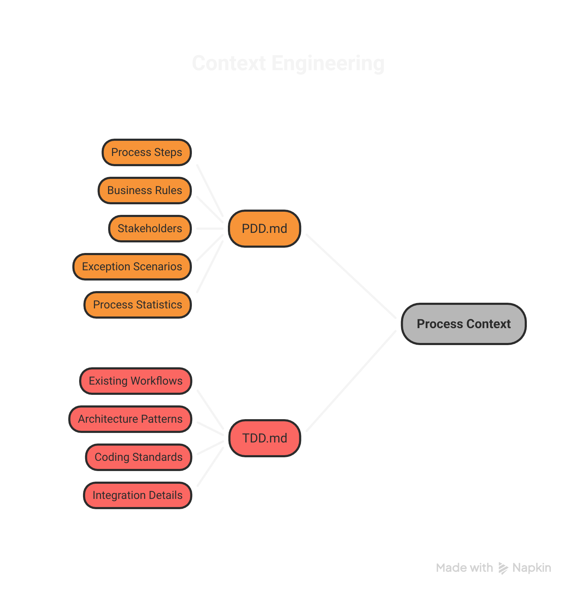
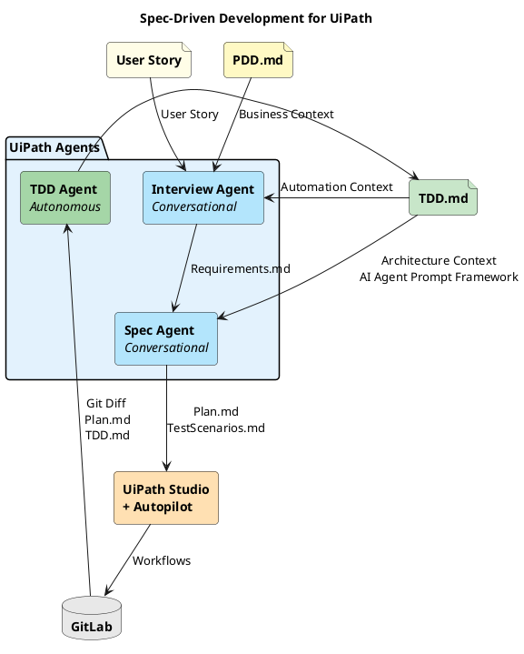
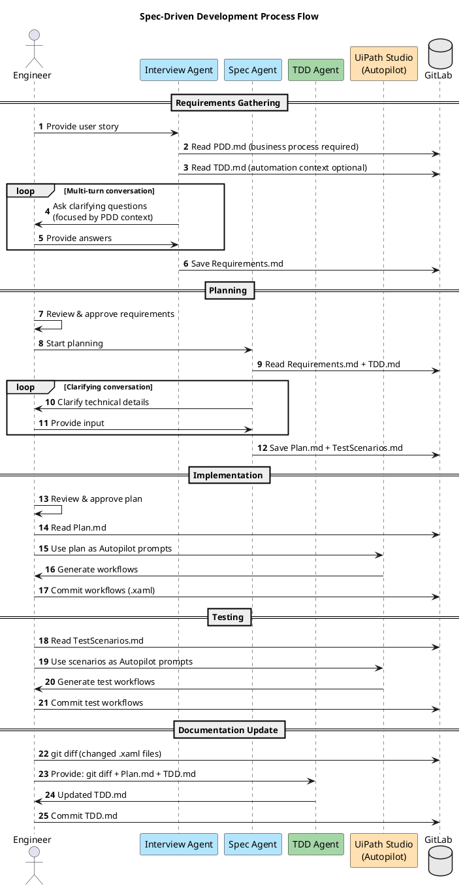

# Spec-Driven Development for UiPath

AI agents that participate in your SDLC—gathering requirements, writing specs, and keeping documentation in sync—so engineers can focus on building.

## Why AI Agents in the SDLC?

Most of the work between a user story and production code isn't coding—it's the overhead around it: interviewing stakeholders, writing specs, choosing architecture patterns, documenting what was built. These are structured, repeatable tasks that AI agents can handle when given the right context.

This project demonstrates that pattern with three AI agents built in UiPath Agent Builder that automate the requirements-to-implementation pipeline for UiPath workflow development. The same approach—specialized agents with structured context—applies to any SDLC.

## The Problem They Solve

Turning user stories into production-ready UiPath workflows involves:
- Gathering detailed requirements (often incomplete in tickets)
- Designing the right architecture and workflow structure
- Writing workflow specifications detailed enough for implementation
- Keeping documentation in sync with code changes

This is time-consuming and error-prone, especially for complex automations.

## The Key Insight: Context Engineering

AI agents are only as good as the context they receive. Two documents give these agents everything they need to make informed decisions:



### PDD.md - Business Process
The Process Definition Document captures the **AS-IS business process**—what humans do today before automation. It contains:

- Process steps and workflow diagrams
- Business rules and decision points
- Stakeholders and their roles
- Exception scenarios
- Process statistics (volume, duration)

**Creation Methods**: UiPath Task Capture is recommended for comprehensive process capture with screenshots and timing data, but PDDs can also be created through process workshops, interviews, or other documentation methods.

The Interview Agent reads PDD and extracts **only the relevant context** for each user story into Requirements.md.

### TDD.md - Automation Architecture
The Technical Design Document (not Test-Driven Development) captures **existing automation architecture**:

- Existing workflows and their responsibilities
- Architecture patterns in use
- Coding standards and conventions
- Integration details

Without TDD context, agents might suggest incompatible approaches. With it, they can say "modify existing X" vs "create new Y".

| Document | Focus | Created By | Used By |
|----------|-------|------------|---------|
| **PDD.md** | AS-IS business process | Business Analyst (e.g., using Task Capture) | Interview Agent |
| **TDD.md** | Automation architecture | TDD Agent | Interview Agent, Spec Agent |

## How It Works

Three agents built with UiPath Agent Builder automate the requirements-to-implementation pipeline:


### 0. Process Documentation
Before starting, ensure you have:
- **PDD.md**: Process Definition Document capturing the AS-IS business process
  - Documents the AS-IS business process (what humans do today)
  - Contains process steps, business rules, stakeholders, decisions, exceptions
  - Can be created using UiPath Task Capture or other process documentation methods

### 1. Requirements Gathering
Engineer provides a user story to the **Interview Agent**, which:
- Reads PDD.md (required) to understand the AS-IS business process
- Reads TDD.md (optional) to understand existing automation architecture
- Extracts ONLY relevant business context from PDD for this specific story
- Asks clarifying questions focused on gaps not covered by PDD/TDD
- Generates focused Requirements.md with relevant business context

### 2. Planning
The **Spec Agent** takes approved requirements and:
- Determines optimal architecture (REFramework, Dispatcher-Performer, etc.)
- Decomposes into atomic, testable workflows
- Creates detailed Plan.md with Autopilot-ready prompts
- Generates TestScenarios.md for testing

### 3. Implementation
Engineer uses **UiPath Studio + Autopilot**:
- Open Plan.md workflow specifications
- Paste specs into Autopilot to generate workflows
- Review, refine, and commit to GitLab

### 4. Documentation Update
The **TDD Agent** receives git diff and:
- Cross-references changes with Plan.md
- Updates TDD.md with new/changed workflow documentation
- Maintains the project's single source of truth

## Architecture

### High-Level Architecture



| Agent/Step | Role | Input | Output |
|-------|------|-------|--------|
| **Interview Agent** | BA Expert | • User Story<br>• PDD.md (required)<br>• TDD.md (optional) | • Requirements.md |
| **Spec Agent** | Solution Architect | • Requirements.md<br>• TDD.md | • Plan.md<br>• TestScenarios.md |
| **Engineer + Autopilot** | Implementation | • Plan.md<br>• TestScenarios.md | • Workflows (.xaml) |
| **TDD Agent** | Technical Writer | • Git diff<br>• Plan.md | • Updated TDD.md |

### End-to-End Process Flow



## Quick Start

1. **Create PDD (Required)**
   - Document the AS-IS business process
   - Include process steps, business rules, decisions, exceptions
   - Recommended: Use UiPath Task Capture for comprehensive capture with screenshots and timing data
   - Alternative: Create through process workshops, interviews, or other documentation methods
   - See [templates/PDD_EXAMPLE.md](./templates/PDD_EXAMPLE.md) for reference format

2. **Set up project documentation (For existing projects)**
   - Create TDD.md using the [template](./templates/TDD_TEMPLATE.md)
   - Document your existing automation architecture
   - See [templates/TDD_EXAMPLE.md](./templates/TDD_EXAMPLE.md) for reference format

3. **Build the Interview Agent**
   - Follow [agents/interview/README.md](./agents/interview/README.md)
   - Use prompts from [agents/interview/PROMPTS.md](./agents/interview/PROMPTS.md)

4. **Build the Spec Agent**
   - Follow [agents/spec/README.md](./agents/spec/README.md)
   - Use prompts from [agents/spec/PROMPTS.md](./agents/spec/PROMPTS.md)

5. **Test with a real user story**
   - Start with a well-understood story for validation
   - Compare agent output to how you'd approach it manually

## Documentation

| Document | Purpose |
|----------|---------|
| [ARCHITECTURE.md](./ARCHITECTURE.md) | Deep-dive technical reference |
| [Interview Agent](./agents/interview/README.md) | Building the requirements agent |
| [Spec Agent](./agents/spec/README.md) | Building the planning agent |
| [TDD Agent](./agents/tdd/README.md) | Building the documentation agent |
| [Autopilot Guide](./studio/AUTOPILOT_GUIDE.md) | Using Autopilot with Plan.md |
| [PDD Example](./templates/PDD_EXAMPLE.md) | Sample Process Definition Document |
| [TDD Template](./templates/TDD_TEMPLATE.md) | Project documentation template |
| [TDD Example](./templates/TDD_EXAMPLE.md) | Sample Technical Design Document |

## Prerequisites

- UiPath Studio 2024.10+
- UiPath Agent Builder access
- UiPath Autopilot enabled
- GitLab (or other VCS) for version control

## Artifacts

| Artifact | Created By | Used By |
|----------|------------|---------|
| PDD.md | Business Analyst (e.g., using Task Capture) | Interview Agent |
| TDD.md | TDD Agent (maintained) | Interview Agent, Spec Agent |
| Requirements.md | Interview Agent | Spec Agent, Engineer |
| Plan.md | Spec Agent | Engineer (Autopilot), TDD Agent |
| TestScenarios.md | Spec Agent | Engineer |
| Workflows (.xaml) | Engineer + Autopilot | TDD Agent, GitLab |

## Project Structure

```
uipath-spec-driven-development/
├── README.md                 # This file - start here
├── ARCHITECTURE.md           # Detailed technical reference
│
├── diagrams/
│   ├── architecture.puml     # Diagram source (PlantUML)
│   ├── architecture.png      # High-level architecture diagram
│   └── sequence.png          # Process flow diagram
│
├── images/
│   ├── Process-Context.png   # PDD vs TDD visual
│   └── Spec-Driven Development Process.png  # Process flow visual
│
├── agents/
│   ├── interview/            # Interview Agent
│   │   ├── README.md         # Setup guide
│   │   ├── PROMPTS.md        # System prompts
│   │   └── examples/         # Sample chat and output
│   ├── spec/                 # Spec Agent
│   │   ├── README.md         # Setup guide
│   │   ├── PROMPTS.md        # System prompts
│   │   └── examples/         # Sample plan output
│   └── tdd/                  # TDD Agent
│       ├── README.md         # Setup guide
│       └── PROMPTS.md        # System prompts
│
├── templates/
│   ├── PDD_EXAMPLE.md        # Sample Process Definition Document
│   ├── TDD_TEMPLATE.md       # Project documentation template
│   └── TDD_EXAMPLE.md        # Sample Technical Design Document
│
└── studio/
    └── AUTOPILOT_GUIDE.md    # Using Autopilot with Plan.md
```

## Resources

[](https://deepwiki.com/eddiefleurent/uipath-spec-driven-development) **Ask DeepWiki about this codebase** — AI-powered Q&A for understanding the three-agent system, process flow, and implementation details.
